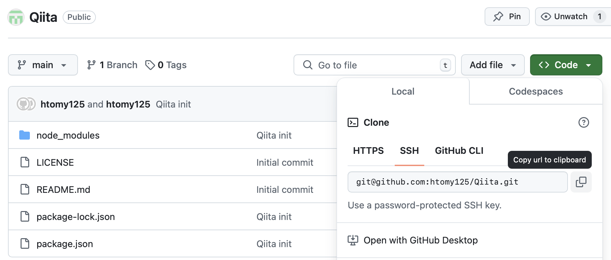
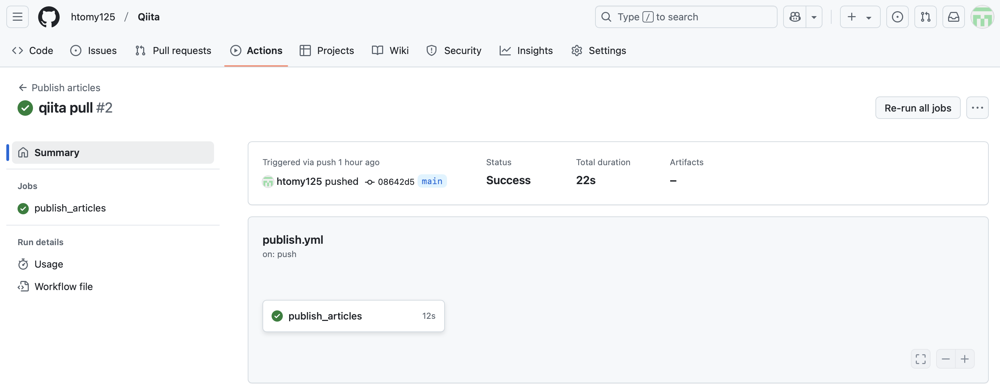

# 概要
* Qiita の記事を書こうと思ったので、GitHubで管理できる環境をセットアップします
* そして、セットアップした環境から、この記事を投稿してみます！

# 環境

* MmacOS Sequoia 15.2

# セットアップの流れ

## GitHubのリポジトリを作成

* ここでは「Qiita」という名前で作成します

## 手元のMacにローカルリポジトリを準備

### GitHubの公開鍵認証を設置(まだの場合)

* 手元のMacでssh鍵が作成されていることを確認

```sh
$ ls ./.ssh/id_rsa*
./.ssh/id_rsa		./.ssh/id_rsa.pub
```

* 公開鍵(id_rsa.pub)をGitHubの次の場所に設定します
  - GitHubのユーザー画面の右上のユーザーアイコンをクリック
  - **Settings** を選択
  - 画面左のメニューから **SSH and GPG keys** を選択
  - **SSH keys** から **New SSH key** をクリック
    + Title にここでは「MacBookAir」を設定
    + Key に **id_rsa.pub** の内容をコピペ

* SSH認証ができていることを確認します。  
以下の様に、「Hi <ユーザー名>! ...」と表示されば問題ありません。

```sh
$ ssh -T git@github.com
Hi htomy125! You've successfully authenticated, but GitHub does not provide shell access.
```

### GitHubのWebページから作成したリモートリポジトリをクローン

* リポジトリ(ここでは Qiita というリポジトリ)の画面から、**Code** をクリック、  
SSHタブを選択して表示される文字列をコピーします


* ローカルリポジトリを作成したディレクトリで以下を実行し、リポジトリ名のディレクトリが作成されていることを確認します

```sh
$ git clone git@github.com:htomy125/Qiita.git
$ ls -d ./Qiita
./Qiita
```

## Qiita CLIの設定

* [こちらのページ](https://github.com/increments/qiita-cli?tab=readme-ov-file)を参考にします

### nodeのインストール

* セットアップでnpmコマンドを使用するため、nodeを導入します  
ここでは Homebrew を使用しています

```sh
$ brew install node
```

### Qiita CLIの設定

* Gitのローカルリポジトリのディレクトリの移動します

```sh
$ cd ./Qiita
```

* コマンドを列挙して記載します。説明は[記事](https://github.com/increments/qiita-cli?tab=readme-ov-file#qiita-cli-の導入方法について)を参照してください。

```sh
$ npm install @qiita/qiita-cli --save-dev
$ npx qiita version
$ npx qiita init
```

* Qiita のトークンを発行し([記事のこちら参照](https://github.com/increments/qiita-cli?tab=readme-ov-file#qiita-のトークンを発行する))、トークンは控えておきます。

#### GitHubにトークンの設定

* **一度、記事の流れから外れて、**  
トークンをGitHubの以下に設定します。
  - リポジトリ(ここではQiita)の画面上部のタブから **Settings** を選択
  - 画面左のメニューから **Secrets and variables** を選択
  - **Actions** をクリック(画像では最左下)


* トークンの設定箇所の続き...
  - **Repository secrets** で **New repository secrets** をクリック
    + Name に `QIITA_TOKEN` を指定(この文字列であることが必要)
    + Secret に控えておいたトークンを貼り付け


#### ここから記事の流れにもどります([ここから](https://github.com/increments/qiita-cli?tab=readme-ov-file#qiita-cli-のログイン))

* 以下を実行し、トークンの入力を求められるので、控えておいたものを入力します。  

```sh
$ npx qiita login
```
## Qiita CLIのセットアップの結果をGitHubにプッシュ

```sh
$ git add .
$ git commit -m "qiita init."
$ git push origin
```

* ここまでで、セットアップは完了です。
* ただし、github へpushしてもQiitaへは同期されませんでした、  
この記事の末尾にその後の対応を追記しています。  

# 記事作成の流れ

* コマンドを実行することで、Qiita記事を記載する newArticle001.md が作成されます  
  - 記事作成中に以下のコマンド実行したので、貼り付けた画像ファイル(.png)もあります
  - 記事作成は VSCode で行っています、  
  スクリーンショットを Markdown編集画面に貼り付けてますがこれで上手くいくのか...
  → 上手く行きませんでしたので、QiitaのWeb画面で編集しています。

```sh
$ npx qiita new
$ ls -l ./public
total 1192
-rw-r--r--  1 hiroshi  staff  408267  1  5 15:51 image-1.png
-rw-r--r--  1 hiroshi  staff  190483  1  5 15:27 image.png
-rw-r--r--  1 hiroshi  staff    4297  1  5 16:18 newArticle001.md
```

* ここまでで commit、push します。  
※今後はbranch切って記事作成などしようかと思います。

```sh
$ git add .
$ git status 
On branch main
Your branch is up to date with 'origin/main'.

Changes to be committed:
  (use "git restore --staged <file>..." to unstage)
	new file:   public/image-1.png
	new file:   public/image.png
	new file:   public/newArticle001.md
$ git commit -m "title:Qiita記事をGitHub管理する環境の準備"
$ git push origin
```

## VSCodeでコピペした画像をQiitaに反映させる(追記)

* VSCodeで画像を.md にコピペすると次の様なテキストが貼り付けられます。  
画像ファイルも.mdと同じディレクトリに保存される。  

```

```

* ただ、これではQiitaに反映したときに画像ファイルは認識されないため次を行います。
  1. ローカルの画像ファイルをQiitaのWeb画面に貼り付け
  2. Qiita上で更新した記事をローカルに同期
  ```sh
  $ npx qiita pull
  ```
  3. Qittaから同期した結果をgithubにpush  
  差分としては以下の様になります。
  ```sh
  - 
  + 
  ```

# GitHubへpushしてもQiitaへ同期されない問題への対応(追記)

* セットアップをしたところで、この記事をgithubにpushしてみたのですが、  
残念ながらQiitaには反映されませんでした
* 対応内容を記載していこうと思います。

## .github/workflows/publis.yml がない！

* 別のディレクトリで Qiita CLIをインストールしなおして気がつきましたが、  
いくつかのファイルが存在しなかった様です。
* その1つが publish.ymlだった訳ですが、.gitignore、qiita.config.json もありませんでした。
* ということで、これらのファイルをもともとセットアップしていたディレクトリにコピーしました。  
※確認したところディレクトリ名などの情報はファイルに含まれませんでした。
* なぜ、これらが無くなってしまっていたかは分かりません、  
うっかり消してしまったか、何らかの理由で作成されていなかったか、かなと思います。
* 存在しなかったファイルを復旧させるのと併せ得て、  
.gitignore に書かれているファイルは gitの管理からは外しておきました。

## 再度 push をしたところ...

* 裏では、GitHub Actions が動作するので結果を確認します。  
→ 成功していました！



* Qiitaの方にも無事記事が反映され良かったです。
